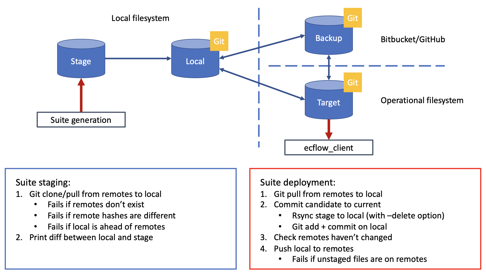

Usage
=====

Installation
------------

To install tracksuite using pip (requires Python and ecFlow):

.. code-block:: bash

    python -m pip install .

Command line examples
---------------------

To initialise the remote target git repository:

.. code-block:: bash

    tracksuite-init --target TARGET [--backup BACKUP] [--host HOST] [--user USER] [--force]

To stage and deploy a suite:

.. code-block:: bash

    tracksuite-deploy --stage STAGE --local LOCAL --target TARGET [--backup BACKUP] [--host HOST] [--user USER] [--push] [--message MESSAGE]

Overview
--------

